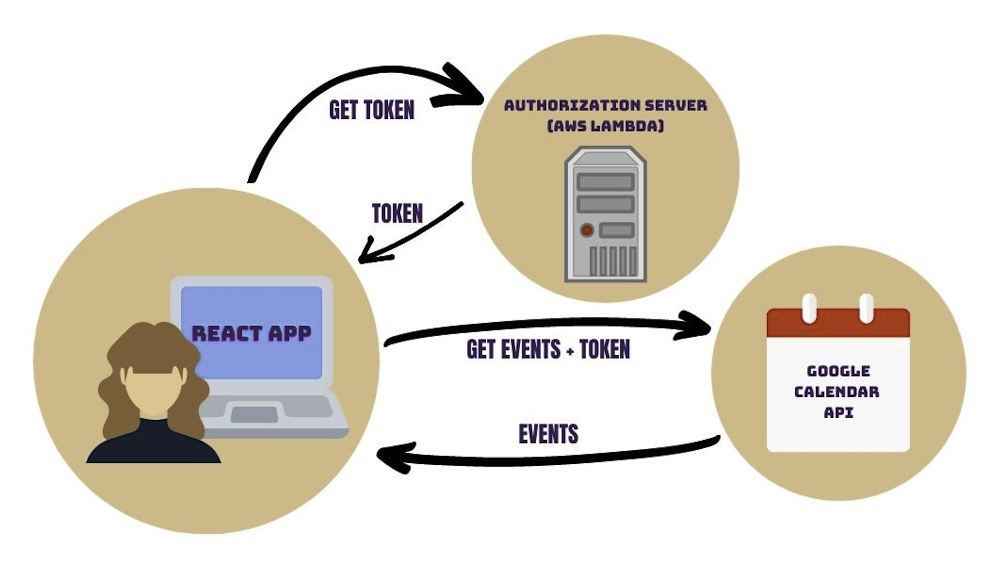

# Meet App 🎯

The objective of this project is to build a serverless, progressive web application (PWA) with React using a test-driven development (TDD) technique. The application uses the Google Calendar API to fetch upcoming events.

### Key Features:

- Filter events by city.
- Show/hide event details.
- Specify number of events.    
- Use the app when offline.
- Add an app shortcut to the home screen.
- View a chart showing the number of upcoming events by city.

### User Stories and Scenarios

    FEATURE 1: FILTER EVENTS BY CITY
    
**User Story:**  As a user, I should be able to filter events by city, So that I can see the list of events that take place in that city.

| **Scenario** | When user hasn’t searched for a city, show upcoming events from all cities | User should see a list of suggestions when they search for a city                | User can select a city from the suggested list                                                                                         |
|--------------|----------------------------------------------------------------------------|----------------------------------------------------------------------------------|----------------------------------------------------------------------------------------------------------------------------------------|
| **Given**    | user hasn’t searched for any city                                          | the main page is open                                                            | the user was typing “Berlin” in the city textbox and the list of suggested cities is showing                                           |
| **When**     | the user opens the app                                                     | user starts typing in the city textbox                                           | the user selects a city (e.g., “Berlin, Germany”) from the list                                                                        |
| **Then**     | the user should see a list of all upcoming events                          | the user should see a list of cities (suggestions) that match what they’ve typed | their city should be changed to that city (i.e., “Berlin, Germany”) and the user should receive a list of upcoming events in that city |

 

    FEATURE 2: SHOW/HIDE AN EVENT’S DETAILS

**User Story:**  As a user, I should be able to click on a button, So that I can see more details or hide the details of an event

| **Scenario** | An event element is collapsed by default                                                           | User can expand an event to see its details                                                  | User can collapse an event to hide its details                                     |
|--------------|----------------------------------------------------------------------------------------------------|----------------------------------------------------------------------------------------------|------------------------------------------------------------------------------------|
| **Given**    | a list of upcoming events being displayed                                                          | a list of upcoming events being displayed                                                    | user is seeing the details about an event after clicking the "Show details" button |
| **When**     | the user has not yet interacted with an event list                                                 | the user clicks on the "See more" button                                                     | the user clicks on the "Hide details" button                                       |
| **Then**     | all events' details should be hidden and display a "See details" button for each event in the list | the event should expand and display the details. Also, a "Hide details" button should appear | the event should be collapsed and hide the details                                 |

   

    FEATURE 3: SPECIFY NUMBER OF EVENTS

**User Story:**  As a user, I should be able to specify the number of events displayed, So that I can see as many events as I want

 
| **Scenario** | When user hasn’t specified a number, 32 is the default number | User can change the number of events they want to see                                 |
|--------------|---------------------------------------------------------------|---------------------------------------------------------------------------------------|
| **Given**    | the user searched for a specific city                         | the user searched for a specific city                                                 |
| **When**     | the user didn't specify how many events he wants to see       | the user selected in the "Number of Events" field how many events he wants to see     |
| **Then**     | by default, a maximum of 32 events will be loaded             | the page will load a max. number of events equal to how many events the user selected |

   

    FEATURE 4: USE THE APP WHEN OFFLINE

**User Story:**  As a user, I should be able to use the App when I am offline, So that I can see at least the events I saw before when I was online

  | **Scenario** | Show cached data when there’s no internet connection | Show error when user changes the settings (city, time range).                                                        |
|--------------|------------------------------------------------------|----------------------------------------------------------------------------------------------------------------------|
| **Given**    | user already opened the app while was online         | user is offline                                                                                                      |
| **When**     | the user wants to see the events but is offline      | the user wants to change the settings, like the city or the number of events                                         |
| **Then**     | app will load cached data from the last session      | user will receive an error message saying that is not possible to make the changes because of no internet connection |

   

    FEATURE 5: DATA VISUALIZATION

**User Story:**  As a user, I should be able to see a chart with the upcoming events in each city, So that I can broadly see what is happening in each city.

  
| **Scenario** | Show a chart with the number of upcoming events in each city.                          |
|--------------|----------------------------------------------------------------------------------------|
| **Given**    | main page is loaded                                                                    |
| **When**     | user has not searched or interacted with the page yet                                  |
| **Then**     | a chart with all upcoming events in each city will be displayed at the top of the page |

 

### How will Serverless functions be used in the Meet app?

In order to access the Google Calendar API through the Meet app, users need to be authorized. This is done through a token generated by an authorization server, which cross-references the user's key and secret (like a username and password) to ensure they are authorized. Once the token is generated, it is sent along with every request the user makes via the app, allowing the API to identify the user and send back the requested data. The authorization server's role is to deliver these tokens, which is where serverless architecture can be used.

To summarize, only authorized users can view event data from the Google Calendar API through the Meet app. The authorization server generates a token for each user, which is used to grant access. This server will be hosted using serverless functions, such as AWS Lambda. The token generated by the authorization server will provide the necessary access for users to view event data from the API.

